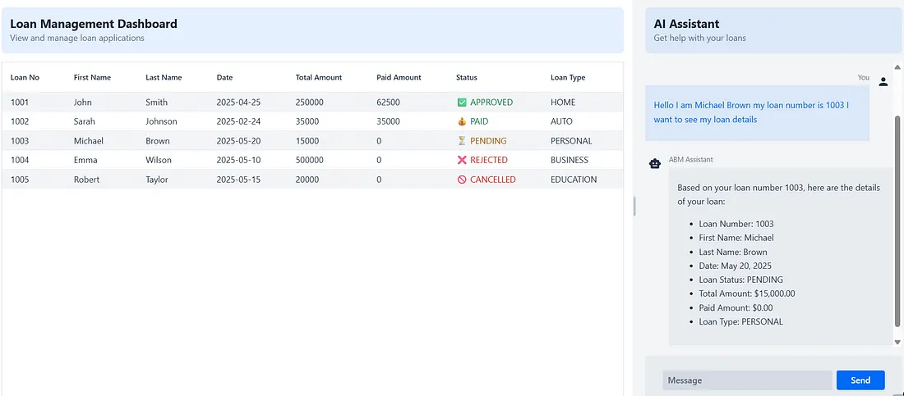

# ABM Bank Application

A Spring Boot application demonstrating the integration of Generative AI (using Ollama) with Retrieval Augmented Generation (RAG) for intelligent banking customer support.

## Application Inside 


## Core AI Features

### 1. Generative AI with Ollama
- Local LLM integration using Ollama
- Real-time chat responses
- Context-aware conversations
- Natural language understanding for banking queries
- Model customization and fine-tuning capabilities
- Streaming response generation
- Token management and optimization

### 2. Retrieval Augmented Generation (RAG)
- Vector-based document storage
- Semantic search capabilities
- Integration with banking documents and policies
- Enhanced response accuracy with relevant context
- Automatic document ingestion and indexing
- Chunking and embedding strategies
- Similarity threshold management
- Context window optimization

### 3. Chat History Management
- Persistent conversation memory
- Context retention across sessions
- Message window management
- Conversation state tracking
- Memory optimization techniques
- Session management
- Context window sliding

## Technical Implementation

### AI Components
- **Vector Store**: Stores and retrieves relevant banking documents
  - Uses Spring AI's SimpleVectorStore
  - Configurable similarity thresholds
  - Efficient vector search algorithms
  - Document chunking strategies

- **Embedding Model**: Converts text into vector representations
  - Text preprocessing
  - Vector dimensionality management
  - Embedding quality optimization
  - Batch processing capabilities

- **Chat Memory**: Maintains conversation history
  - Message window implementation
  - Memory repository integration
  - Context window management
  - Memory cleanup strategies

- **AI Tools**: Custom tools for banking operations
  - Tool parameter validation
  - Error handling and recovery
  - Tool execution monitoring
  - Response formatting

- **RAG Pipeline**: Combines retrieval and generation for accurate responses
  - Document retrieval optimization
  - Context relevance scoring
  - Response generation strategies
  - Quality assurance mechanisms

### How It Works
1. User sends a query
2. System retrieves relevant banking documents using vector similarity
   - Text preprocessing and normalization
   - Vector similarity calculation
   - Relevance scoring
   - Context selection
3. Context is combined with conversation history
   - Memory retrieval
   - Context window management
   - History relevance assessment
4. LLM generates a response using the combined context
   - Prompt engineering
   - Context injection
   - Response generation
   - Quality checks
5. Response is streamed back to the user
   - Token streaming
   - Response formatting
   - Error handling
6. Conversation is stored for future context
   - Memory persistence
   - Context window updates
   - History management

## Technical Stack

### Backend
- **Spring Boot**: Core application framework
- **Spring AI**: AI framework integration
- **Ollama**: Local LLM integration
- **Vector Store**: Document storage and retrieval

### Frontend
- **Vaadin Hilla**: Modern web framework
- **React**: UI components
- **TypeScript**: Type-safe development
- **Tailwind CSS**: Styling

## Features

- AI-powered customer support chat with context awareness
- Loan management system
- Loan status tracking
- Extra payment processing
- Loan cancellation functionality
- Modern, responsive UI
- Real-time chat interface
- Interactive loan management dashboard

## Prerequisites

### Backend
- Java 17 or higher
- Maven 3.6 or higher
- Spring Boot 3.x
- Spring AI dependencies
- Ollama installed and running locally
- Sufficient system resources for LLM operations

### Frontend
- Node.js 16 or higher
- npm 7 or higher
- Modern web browser

## Setup

### Backend Setup
1. Clone the repository:
```bash
git clone https://github.com/yourusername/abm-bank.git
cd abm-bank
```

2. Install Ollama:
```bash
# Follow instructions at https://ollama.ai/download
```

3. Configure Ollama model:
```bash
# Pull the required model
ollama pull mistral  # or your preferred model
```

4. Build the project:
```bash
mvn clean install
```

### Frontend Setup
1. Install frontend dependencies:
```bash
cd frontend
npm install
```

2. Start the development server:
```bash
npm run dev
```

3. Build for production:
```bash
npm run build
```

### Running the Application
1. Start the backend:
```bash
mvn spring-boot:run
```

2. Access the application:
- Development: http://localhost:8080
- Production: http://localhost:8080

## Project Structure

```
com.abmbank
├── ai/
│   ├── assistant/    # AI chat implementation
│   │   ├── AiAssistant.java      # Main AI chat logic
│   │   └── ChatConfig.java       # Chat configuration
│   ├── config/       # AI configuration and setup
│   │   ├── AiConfig.java         # Core AI configuration
│   │   └── VectorStoreConfig.java # Vector store setup
│   └── tools/        # Custom AI tools for banking operations
│       ├── AiTools.java          # Tool implementations
│       └── dto/                  # Tool request/response DTOs
├── domain/           # Core business entities
├── dto/             # Data transfer objects
├── exception/       # Custom exception handling
└── service/         # Business logic implementation

frontend/
├── src/
│   ├── components/  # React components
│   ├── views/       # Page components
│   ├── services/    # API services
│   └── styles/      # CSS styles
├── public/          # Static assets
└── package.json     # Dependencies
```

## Frontend Features

### Chat Interface
- Real-time message streaming
- Message history display
- Typing indicators
- Error handling
- Responsive design

### Loan Management Dashboard
- Loan status overview
- Payment processing
- Loan cancellation
- Data visualization
- Interactive forms

### User Experience
- Modern, clean interface
- Responsive design
- Loading states
- Error handling
- Success notifications

## Development

### Frontend Development
1. Start the development server:
```bash
cd frontend
npm run dev
```

2. Run tests:
```bash
npm test
```

3. Build for production:
```bash
npm run build
```

### Backend Development
1. Run tests:
```bash
mvn test
```

2. Build the project:
```bash
mvn clean install
```

## Contributing

1. Fork the repository
2. Create your feature branch
3. Commit your changes
4. Push to the branch
5. Create a Pull Request

## License

This project is licensed under the MIT License - see the LICENSE file for details.